# Log-Analysis

I recently completed the log analysis course on TryHackMe, where I explored various types of logs and common log file locations. I learned essential Linux commands for log analysis, including cat, less, tail, wc, cut, sort, uniq, sed, awk, and grep. Additionally, I gained valuable skills in using regular expressions to extract relevant information, filter data, and identify patterns.

## Task3-1
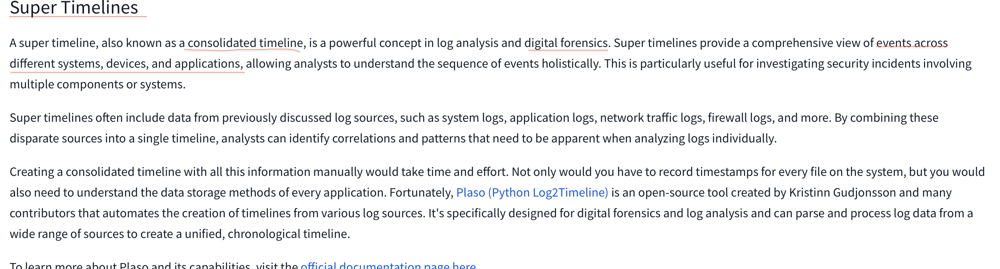

## Task3-2
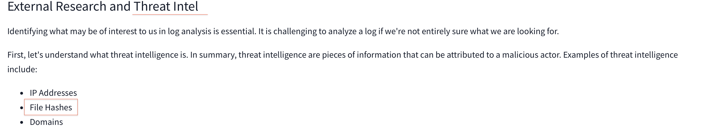

## Task3 Correct Answer
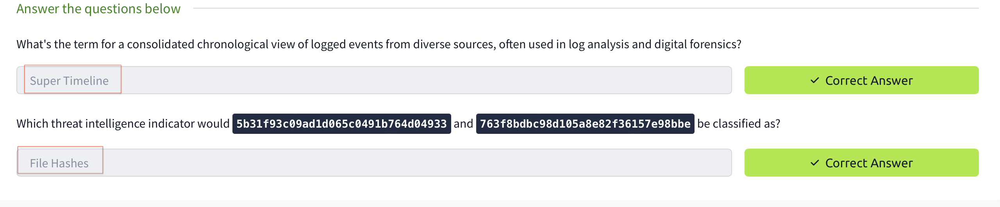

## Task4-1
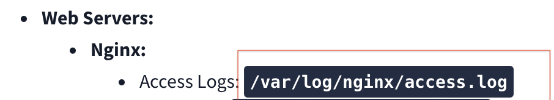

## Task4-2
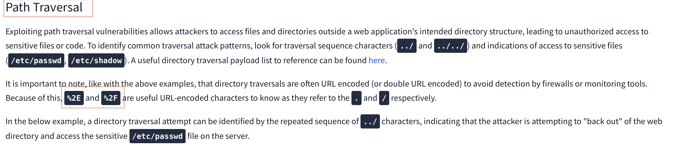

## Task4 Correct Answer
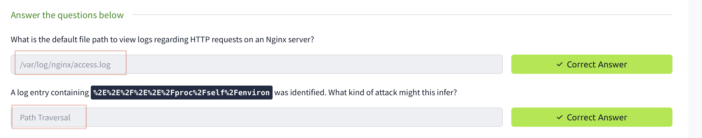

## Task5
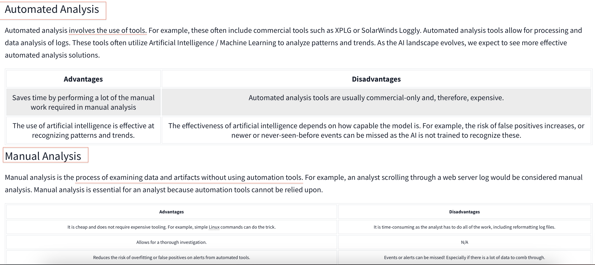

## Task5 Correct Answer
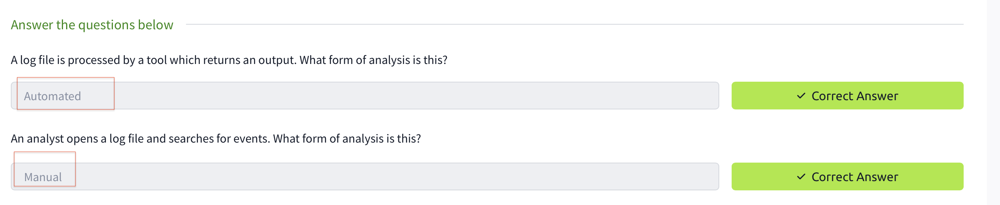

## Task6-1
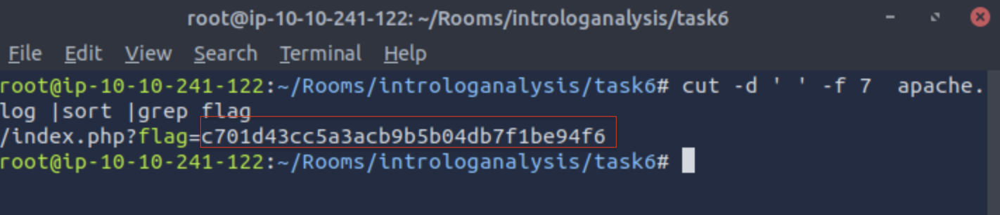

## Task6-2
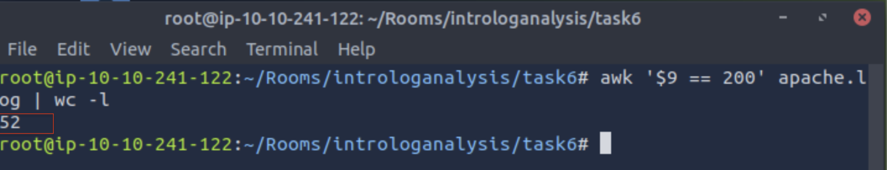

## Task6-3
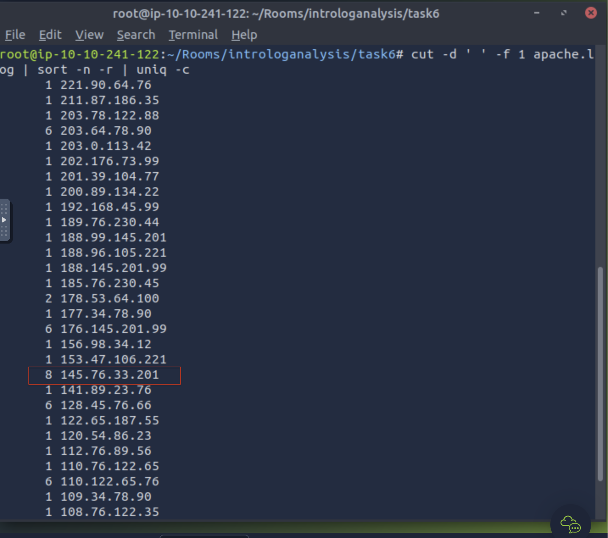

## Task6-4
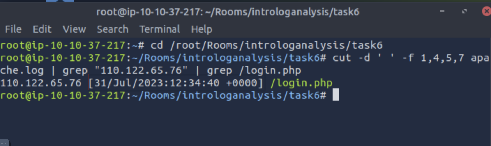

## Task6 Correct Answer
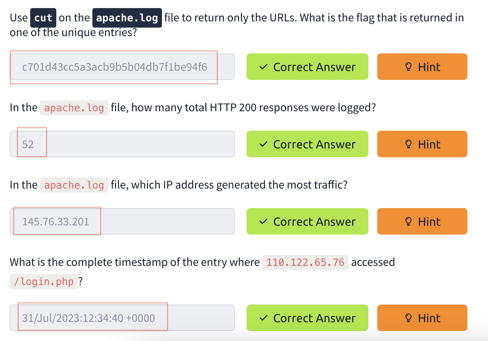

## Task7-1
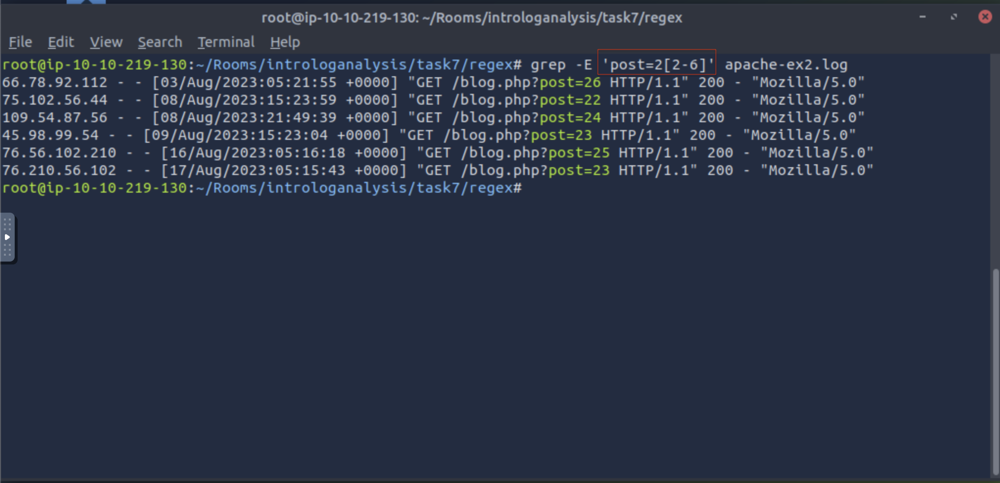

## Task7-2
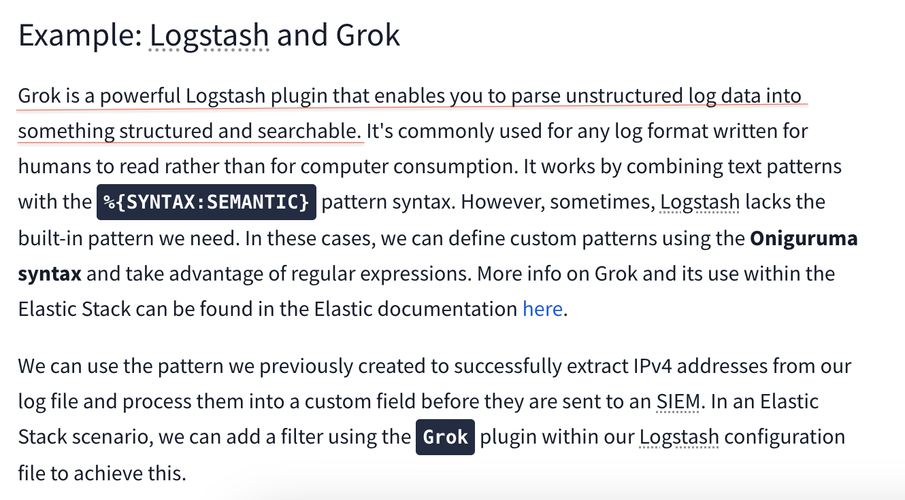

## Task7 Correct Answer
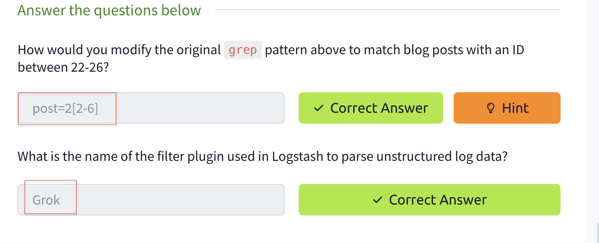

## Task8-2
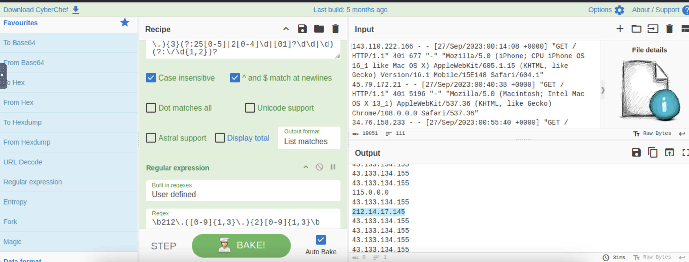

## Task8-3a
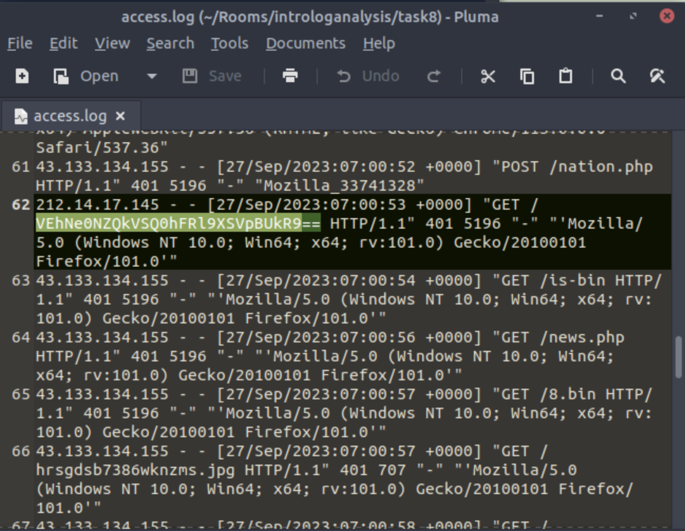

## Task8-3b
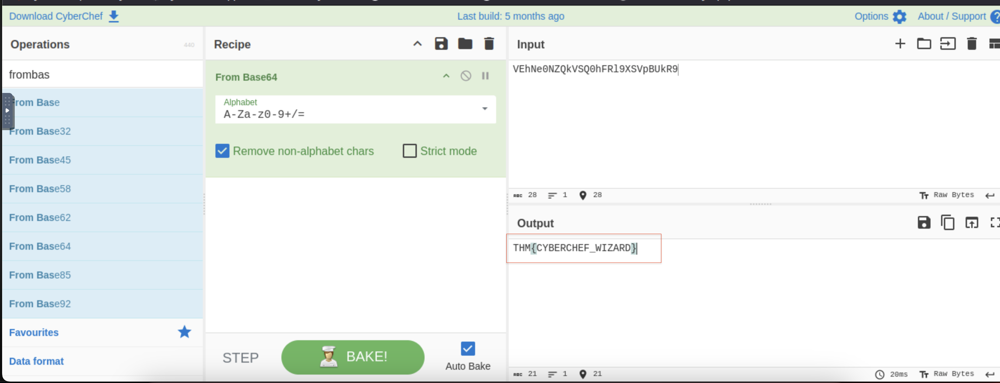

## Task8-4
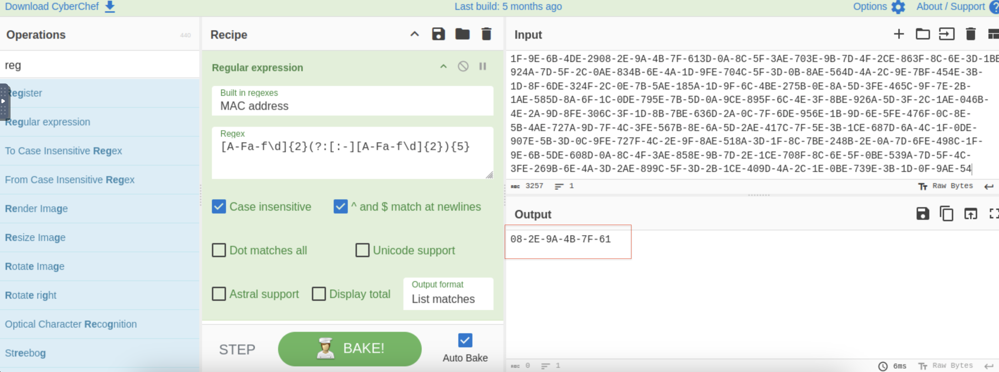

## Task8 Correct Answer
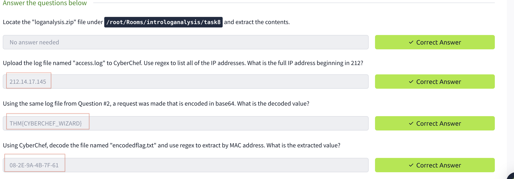

## Task9-1

## Task9-2
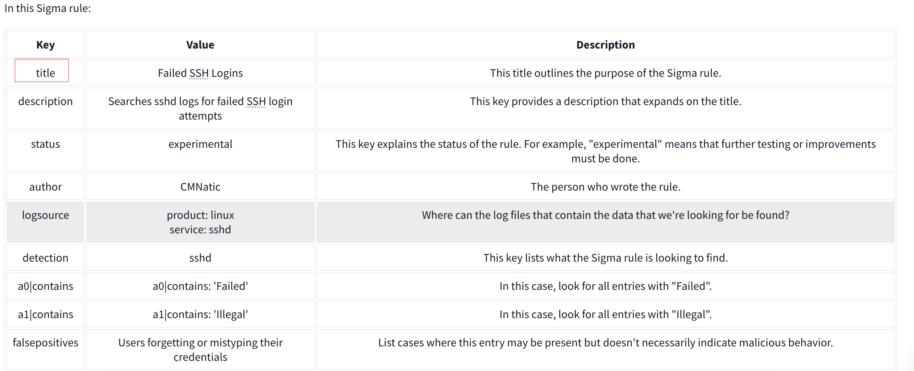

## Task9-3
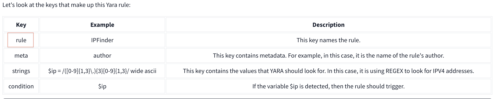

## Task9 Correct Answer 
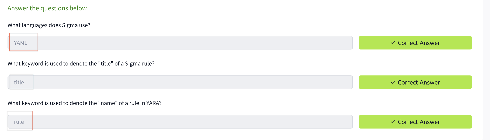

## All Task Completed
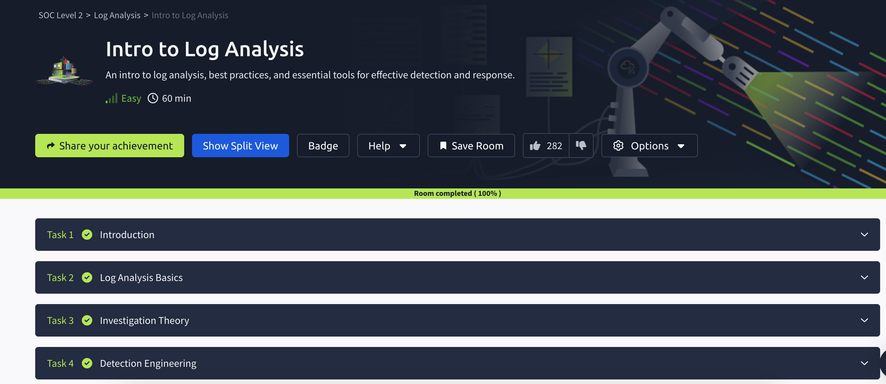
